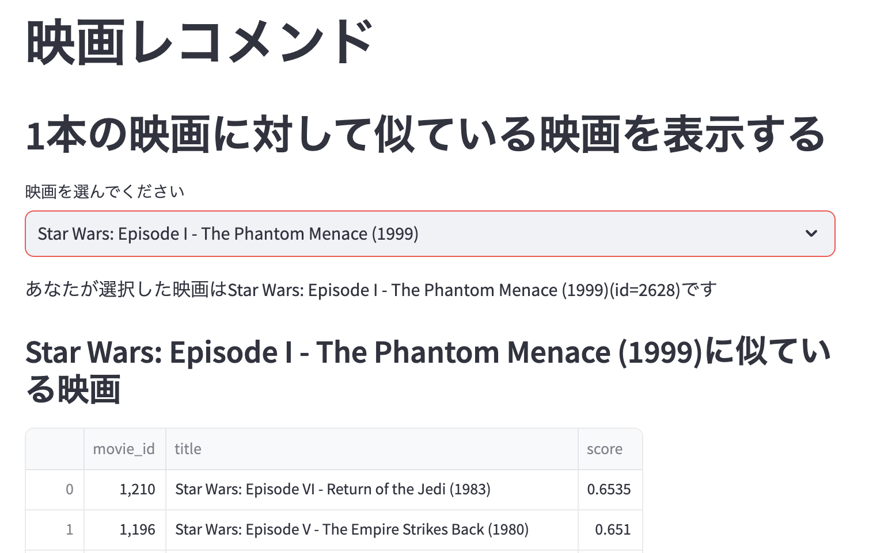

## 概要
* streamlitを用いた映画レコメンドアプリケーション
* データはmovielensの映画データ
* 推薦アルゴリズムは、item2vecを使用（[こちら](https://github.com/oreilly-japan/RecommenderSystems/blob/main/chapter5/colab/Item2vec.ipynb)で学習したモデルを利用。モデルは`data/item2vec.model`に格納されている。）

## インストール
ライブラリをインストール
```
pip install pandas numpy streamlit gensim
```
または、requirements.txtを用いてインストール
```
pip install -r requirements.txt
```

## アプリの起動
```
# サンプルアプリの起動
streamlit run sample.py

# 映画レコメンドアプリの起動
streamlit run app.py
```

## streamlit cloudによる公開
[公開したアプリ](https://movierecommender-ks5bdb5bjsvusrhyakaogb.streamlit.app/)



公開の仕方は、streamlit cloudの[公式ページ](https://streamlit.io/cloud)を参照。